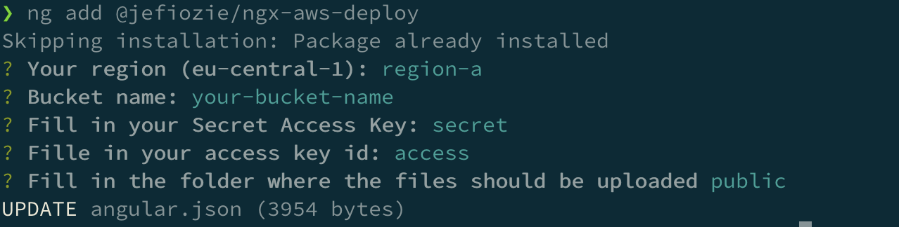

We are very happy and excited to share with you today a new Angular Builder: [NGX-AWS-DEPLOY](https://www.npmjs.com/package/@jefiozie/ngx-aws-deploy)

# What is an Angular Builder?

Most of you probably know that the Angular CLI has some CLI commands, sometimes these commands run a complex process, such as linting, building or testing. Internally they make use of the _Architect_ tool to run CLI Builders. With Angular version 8, the CLI Builder API is stable and available to developers who want to customize the Angular CLI by adding or modifying commands.

An Angular Builder is a function that will be executed by using a specific Angular CLI Command. Because you can run **ANY** command and can make **ANY** implementation you almost could say: _The sky is the limit by adopting Angular Builders_

# Why I created this Angular Builder

I started the project because I was interested in the Angular Builders API. As I'm loving the way you could do a deployment of an Angular App by using [@azure/ng-deploy](http://github.com/Azure/ng-deploy-azure), I had the idea to do this for Amazon's S3 storage. In the past, I've done some work with Amazon and needed to do several steps to upload an Angular app to AWS S3. After looking at the AWS SDK and some examples on the documentation, I created the builder that we now call: ***NGX-AWS-DEPLOY***

# How can we use it?

A builder cannot be used by only installing it via `npm`. For this reason, I've added an easy way by using the Angular CLI command `ng add`. By using the command `ng add @jefiozie/ngx-aws-deploy` it will install the package for you and ask you a couple of questions to setup the project.

After this, you are ready to deploy your app to AWS S3, just run `ng deploy`

# Roadmap?

What does the future bring for this package? I'm not sure yet, I would love to see some feature issues created by the community! Maybe there are use cases I've not yet thought of so please submit your issue or feature on the [NGX-AWS-DEPLOY Repo](https://github.com/Jefiozie/ngx-aws-deploy) 

Some of the ideas are: 

1. Credentials via environment variables [#12](https://github.com/Jefiozie/ngx-aws-deploy/issues/12)
2. Multi-region upload
3. Better progress indicator
4. Allow compressing the app and upload it (maybe an edge case)

# Thank you

Thank you for reading this post I hope you will enjoy ***NGX-AWS-DEPLOY***. A big thanks to the Angular CLI team(and everybody who helped) with creating the builders API I love it 👍🏻

Thanks to people who reviewed this article:

[@bjeaurn](https://twitter.com/bjeaurn)

### _RESOURCES_

- [Angular CLI Builders](https://angular.io/guide/cli-builder)
- [Example of CLI Builder](https://github.com/mgechev/cli-builders-demo)
- [ngx-deploy-starter](https://github.com/angular-schule/ngx-deploy-starter)
- [Angular Builders - website with builders](https://angular-builders.dev)
- [InDepth - Angular Builders](https://medium.com/angular-in-depth/angular-cli-builder-26f0981fb7f3)
